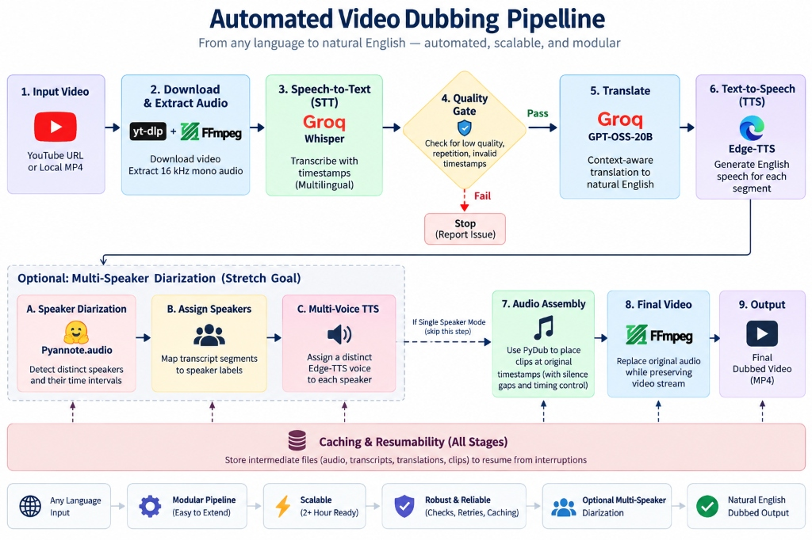
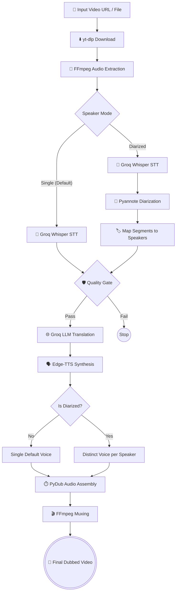

# 🎙️ Automated Video Dubbing Pipeline


<div align="center">
  
</div>

A high-performance, fully automated pipeline that translates and dubs videos into English. Designed for long-form content (2+ hours), the system features asynchronous API calls, robust rate-limit handling, automatic audio timeline assembly, and optional multi-speaker diarization.

---

## ✨ Key Features

- **🚀 Long-Form Ready**: Successfully tested on 2+ hour videos. Implements smart chunking and exponential backoff to respect API rate limits.
- **⚡ Asynchronous TTS**: Synthesizes dozens of audio segments concurrently using `asyncio` to drastically reduce processing time.
- **⏱️ O(1) Audio Assembly**: Assembles hundreds of audio clips onto a master canvas using efficient timestamp-based overlays, rather than sequential appending.
- **🎚️ Smart Audio Ducking & Stretching**: Dynamically adjusts TTS speed (capped at 1.5x to prevent chipmunk effects) to fit the original speaker's timeframe, and lowers the volume of the original background audio when the translated voice speaks.
- **🛡️ Quality Gates**: Automatically halts processing if transcription confidence is too low or repetition loops are detected, preventing wasted API tokens.
- **🧠 Robust LLM Parsing**: Implements resilient regex-based fallback parsers to recover from malformed or truncated JSON responses returned by the translation LLM.
- **🔄 Smart Caching**: Every intermediate artifact (raw audio, JSON transcripts, translation batches, audio clips) is cached locally. If the script crashes or halts, it resumes exactly where it left off.
- **🎭 Multi-Speaker Diarization (Stretch Goal)**: Uses HuggingFace's `pyannote.audio` to detect distinct speakers and dynamically assigns them different text-to-speech voices.

---

## 🏗️ Architecture

The pipeline supports two execution paths: the **Core Single-Speaker Mode** and the **Stretch Diarized Mode**.



---

## 🚀 Installation & Setup

1. **Clone the repository:**
   ```bash
   git clone https://github.com/rishivardhan99/automated-video-dubbing.git
   cd automated-video-dubbing
   ```

2. **Set up a virtual environment:**
   ```bash
   python -m venv .venv
   # Windows
   .venv\Scripts\activate
   # Mac/Linux
   source .venv/bin/activate
   ```

3. **Install Core Dependencies:**
   ```bash
   pip install -r requirements.txt
   ```
   *(Note: You must have [FFmpeg](https://ffmpeg.org/) installed and added to your system PATH).*

4. **Configure Environment Variables:**
   Create a `.env` file in the root directory and add your Groq API key:
   ```env
   GROQ_API_KEY=gsk_your_key_here
   EDGE_TTS_VOICE=en-US-SteffanNeural
   ```

---

## 🎮 Usage

### Standard Run (Full Pipeline)
```bash
python run.py "https://youtu.be/YOUR_VIDEO_ID"
```
Or process a local file:
```bash
python run.py "data\input\Your_Video_File.mp4"
```

### Benchmark Mode (60-Second Quick Test)
To quickly verify your environment without processing a full video, extract and test the first 60 seconds:
```bash
python run.py --benchmark "https://youtu.be/YOUR_VIDEO_ID"
```

### 🌟 Multi-Speaker Diarization (Stretch Goal)
To enable the optional stretch goal, you must install the heavy ML dependencies and provide a free HuggingFace token.

1. **Install ML dependencies:**
   ```bash
   pip install -r requirements-diarization.txt
   ```
2. **Add HuggingFace Token to `.env`:**
   ```env
   HF_TOKEN=hf_your_token_here
   SPEAKER_MODE=diarized
   ```
3. **Run the pipeline:**
   ```bash
   python run.py --speaker-mode diarized "https://youtu.be/YOUR_VIDEO_ID"
   ```

---

## 📊 Official Benchmarks

This pipeline has been stress-tested on massive files to prove its caching, rate-limit handling, and performance:

- **30-Minute Audiobook Benchmark**: [YouTube Link](https://youtu.be/BLEYCyrLpkI?si=lon0nuzER4B1r36y)
- **2-Hour Coding Tutorial Benchmark**: [YouTube Link](https://youtu.be/RGKi6LSPDLU?si=Jps-EUb4Ej4JVUjY)

---

## 🧪 Testing

The project includes an extensive suite of offline unit tests (no API keys required).
```bash
pytest tests/ -v
```

---

## 📂 Project Structure

```text
├── src/
│   ├── audio.py         # FFmpeg extraction & muxing
│   ├── diarizer.py      # Pyannote multi-speaker detection
│   ├── downloader.py    # yt-dlp integration
│   ├── quality.py       # Transcript heuristics & safety gates
│   ├── synthesizer.py   # Async Edge-TTS & O(1) PyDub Assembly
│   ├── translator.py    # Chunked LLM Translation with Backoff
│   └── utils/
├── tests/               # Offline pytest suite
├── run.py               # Main pipeline orchestrator
└── commands.txt         # Cheatsheet of terminal commands
```
